# Redis Shell Architecture

Redis Shell is built with a modular, extensible architecture that promotes maintainability and allows for easy customization through extensions.

## Architecture Overview

```mermaid
flowchart TD
    %% User Interface
    A[User Interface<br/>Interactive CLI with<br/>Autocompletion & History]

    %% Core Engine
    B[Redis Shell Core<br/>Command Processing<br/>& Execution Engine]

    %% Management Layer
    C[Extension Manager<br/>Load & Execute Extensions]
    D[Connection Manager<br/>Multi-Redis Connections]
    E[State & Config Manager<br/>Persistent Settings]

    %% Built-in Extensions
    F[Built-in Extensions]
    F1[📊 Data<br/>Import/Export]
    F2[🔗 Connection<br/>Multi-server]
    F3[🏗️ Cluster<br/>Redis Cluster]
    F4[🛡️ Sentinel<br/>High Availability]
    F5[⚙️ Config<br/>Settings]

    %% User Extensions
    G[👤 User Extensions<br/>Custom Functionality]

    %% External Systems
    H[Redis Infrastructure]
    H1[Redis Server]
    H2[Redis Cluster]
    H3[Redis Sentinel]

    %% Connections
    A --> B
    B --> C
    B --> D
    B --> E
    C --> F
    C --> G
    F --> F1
    F --> F2
    F --> F3
    F --> F4
    F --> F5
    D --> H
    F2 --> H1
    F3 --> H2
    F4 --> H3

    %% Styling for presentation
    classDef ui fill:#4285f4,color:#fff,stroke:#1a73e8,stroke-width:3px
    classDef core fill:#34a853,color:#fff,stroke:#137333,stroke-width:3px
    classDef mgmt fill:#ff9800,color:#fff,stroke:#e65100,stroke-width:3px
    classDef ext fill:#9c27b0,color:#fff,stroke:#6a1b9a,stroke-width:3px
    classDef redis fill:#dc143c,color:#fff,stroke:#b71c1c,stroke-width:3px

    class A ui
    class B core
    class C,D,E mgmt
    class F,F1,F2,F3,F4,F5,G ext
    class H,H1,H2,H3 redis
```



## Core Components

### 1. Main Entry Point (`__main__.py`)
- Processes command-line arguments and environment variables
- Initializes the CLI with connection parameters
- Handles single command execution mode
- Sets up logging and configuration

### 2. RedisCLI Class (`cli.py`)
- Main class that orchestrates all functionality
- Handles user input and command processing
- Manages interactive shell functionality
- Coordinates between different managers and extensions

### 3. Configuration Manager (`config.py`)
- Singleton class managing application configuration
- Loads configuration from multiple sources (files, environment variables)
- Provides methods to get and set configuration values
- Supports runtime configuration changes

### 4. State Manager (`state_manager.py`)
- Singleton class managing persistent state across sessions
- Stores command history and extension-specific state
- Handles state serialization and deserialization
- Ensures data consistency across multiple instances

### 5. Connection Manager (`connection_manager.py`)
- Singleton class managing multiple Redis connections
- Automatically detects Redis cluster configurations
- Provides Redis clients to other components
- Handles connection switching and lifecycle management

### 6. Extension Manager (`extension_manager.py`)
- Loads and manages extensions from multiple directories
- Handles extension lifecycle (loading, initialization, shutdown)
- Provides command routing to appropriate extensions
- Manages extension dependencies and conflicts

## Use Cases and User Interactions

```mermaid
flowchart LR
    %% Users
    U1[👤<br/>End User]
    U2[👨‍💼<br/>Redis Admin]
    U3[👩‍💻<br/>Developer]

    %% Core Features
    subgraph CORE[🎯 Core Features]
        C1[Execute Redis Commands<br/>GET, SET, HGET, LPUSH...]
        C2[Interactive Shell<br/>History & Autocompletion]
        C3[Multi-Connection Support<br/>Switch between servers]
    end

    %% Data Management
    subgraph DATA[📊 Data Management]
        D1[Export Redis Data<br/>Pattern-based export]
        D2[Import Data<br/>Bulk data loading]
        D3[Backup & Restore<br/>Database migration]
    end

    %% Infrastructure Management
    subgraph INFRA[🏗️ Infrastructure]
        I1[Deploy Redis Cluster<br/>Automated setup]
        I2[Manage Sentinel<br/>High availability]
        I3[Monitor & Control<br/>Start/stop services]
    end

    %% Extensibility
    subgraph EXT[🔧 Extensibility]
        E1[Create Extensions<br/>Custom commands]
        E2[Plugin Architecture<br/>Modular functionality]
        E3[Configuration<br/>Personalized settings]
    end

    %% User connections
    U1 --> CORE
    U1 --> DATA
    U1 --> EXT

    U2 --> CORE
    U2 --> DATA
    U2 --> INFRA
    U2 --> EXT

    U3 --> CORE
    U3 --> DATA
    U3 --> EXT

    %% Styling for Google Slides
    classDef user fill:#4285f4,color:#fff,stroke:#1a73e8,stroke-width:4px,font-size:14px
    classDef feature fill:#34a853,color:#fff,stroke:#137333,stroke-width:3px
    classDef data fill:#ff9800,color:#fff,stroke:#e65100,stroke-width:3px
    classDef infra fill:#9c27b0,color:#fff,stroke:#6a1b9a,stroke-width:3px
    classDef ext fill:#dc143c,color:#fff,stroke:#b71c1c,stroke-width:3px

    class U1,U2,U3 user
    class C1,C2,C3 feature
    class D1,D2,D3 data
    class I1,I2,I3 infra
    class E1,E2,E3 ext
```



## Extensions System

Redis Shell has a modular extension system that enables powerful customization:

### Built-in Extensions
- **`/data`**: Handles data import/export with pattern matching and progress monitoring
- **`/connection`**: Manages multiple Redis connections with SSL/TLS support
- **`/cluster`**: Manages Redis clusters for development and testing
- **`/config`**: Manages configuration with runtime updates
- **`/sentinel`**: Manages Redis Sentinel for high availability testing

### Extension Architecture
- **Extension Definition**: `extension.json` defines metadata, commands, and completions
- **Command Implementation**: `commands.py` implements the extension's functionality
- **Namespace Isolation**: Each extension operates in its own namespace (e.g., `/data export`)
- **CLI Integration**: Extensions receive the CLI instance for Redis access
- **State Management**: Extensions can store persistent state via StateManager

### Extension Loading
1. **Built-in Extensions**: Loaded from `redis_shell/extensions/` directory
2. **User Extensions**: Loaded from `~/.config/redis-shell/extensions/` directory
3. **Dynamic Loading**: Extensions are loaded at startup and can be reloaded
4. **Dependency Management**: Extensions can specify dependencies and requirements

## Command Flow

The command processing flow in Redis Shell follows a clear hierarchy:

### 1. Command Input
- User enters a command in the interactive shell
- Prompt toolkit handles input with autocompletion and history
- Command is parsed into command name and arguments

### 2. Command Classification
- **Shell Commands**: Commands starting with `/` (e.g., `/help`, `/clear`)
- **Extension Commands**: Namespaced commands (e.g., `/data export`, `/connection list`)
- **Redis Commands**: Standard Redis commands (e.g., `GET`, `SET`, `HGET`)

### 3. Command Routing
```
User Input → RedisCLI → Command Parser
                    ↓
            ┌─── Shell Command? ───→ handle_shell_command()
            │
            ├─── Extension Command? ───→ ExtensionManager.handle_command()
            │
            └─── Redis Command? ───→ ConnectionManager.execute_command()
```

### 4. Command Execution
- **Shell Commands**: Handled directly by RedisCLI
- **Extension Commands**: Routed to appropriate extension's `handle_command()` method
- **Redis Commands**: Sent to Redis server via active connection

### 5. Response Processing
- Results are formatted for display
- Command is added to history
- State is updated if necessary

## State Management

The StateManager provides persistent storage across Redis Shell sessions:

### Features
- **Persistent Storage**: State stored in JSON file (default: `~/.redis-shell`)
- **Extension State**: Extensions can store and retrieve their own state
- **Command History**: Maintains history of executed commands
- **Thread Safety**: Singleton pattern ensures consistency across components

### State Structure
```json
{
  "command_history": ["GET key1", "SET key2 value2", ...],
  "extension_state": {
    "data": {"last_export_path": "/tmp/export.txt"},
    "connection": {"connections": {...}}
  }
}
```

## Connection Management

The ConnectionManager handles multiple Redis connections:

### Capabilities
- **Multi-Connection Support**: Manage multiple Redis instances simultaneously
- **Cluster Detection**: Automatically detects and handles Redis clusters
- **SSL/TLS Support**: Secure connections with certificate management
- **Connection Pooling**: Efficient connection reuse and management

### Connection Types
- **Standard Redis**: Single Redis instance connections
- **Redis Cluster**: Cluster-aware connections with slot mapping
- **SSL/TLS**: Encrypted connections with certificate validation

### Connection Lifecycle
1. **Creation**: New connections created with specified parameters
2. **Validation**: Connection tested and cluster detection performed
3. **Registration**: Connection added to connection registry
4. **Usage**: Active connection used for Redis commands
5. **Cleanup**: Connections properly closed when destroyed

## Design Principles

### 1. Modularity
- Clear separation of concerns between components
- Loose coupling through well-defined interfaces
- Easy to test and maintain individual components

### 2. Extensibility
- Plugin architecture allows custom functionality
- Extensions can access core services (Redis, state, config)
- Namespace isolation prevents extension conflicts

### 3. User Experience
- Intuitive command structure with autocompletion
- Consistent error handling and user feedback
- Rich interactive features (history, colors, formatting)

### 4. Reliability
- Singleton pattern ensures consistent state
- Proper error handling and recovery
- Safe operations with confirmation prompts

This architecture enables Redis Shell to be both powerful for advanced users and accessible for beginners, while maintaining the flexibility to grow through extensions.

## Component Interactions

The following diagram shows how the main components interact during typical operations:

```
┌─────────────────┐    ┌─────────────────┐    ┌─────────────────┐
│   User Input    │───▶│   RedisCLI      │───▶│ Command Parser  │
└─────────────────┘    └─────────────────┘    └─────────────────┘
                                │                       │
                                ▼                       ▼
┌─────────────────┐    ┌─────────────────┐    ┌─────────────────┐
│ State Manager   │◀───│ Extension Mgr   │◀───│ Connection Mgr  │
└─────────────────┘    └─────────────────┘    └─────────────────┘
         │                       │                       │
         ▼                       ▼                       ▼
┌─────────────────┐    ┌─────────────────┐    ┌─────────────────┐
│ Persistent      │    │ Built-in &      │    │ Redis Clients   │
│ State Storage   │    │ User Extensions │    │ (Single/Cluster)│
└─────────────────┘    └─────────────────┘    └─────────────────┘
```

This architecture provides:
- **Separation of Concerns**: Each component has a specific responsibility
- **Loose Coupling**: Components interact through well-defined interfaces
- **Extensibility**: New functionality can be added through extensions
- **Maintainability**: Clear structure makes the codebase easy to understand and modify

